### Hello there [👋](https://www.giantfreakinrobot.com/wp-content/uploads/2022/10/hellothere.gif)

I'm Kristóf, an experienced technology leader with a proven track record in designing, implementing, and aligning innovative technological visions with overarching business objectives.

With a comprehensive understanding of market dynamics, I bring a strategic mindset to drive the development and execution of forward-thinking strategies that foster innovation, scalability, and sustainable growth.

### Current work

🚀 I'm currently working on the hungarian ccTLD ([domain.hu](https://domain.hu)) registy's backend as a contractor via [Apex Lab](https://apexlab.io).

<!--
**hauserkristof/hauserkristof** is a ✨ _special_ ✨ repository because its `README.md` (this file) appears on your GitHub profile.

Here are some ideas to get you started:

- 🔭 I'm currently working on ...
- 🌱 I'm currently learning ...
- 👯 I'm looking to collaborate on ...
- 🤔 I'm looking for help with ...
- 💬 Ask me about ...
- 📫 How to reach me: ...
- 😄 Pronouns: ...
- ⚡ Fun fact: ...
  -->

---

### Current tech stack

#### Currently learning

   

#### Most used tech stack

             

### Certification

<h4>Languages</h4>

      

<h4>Frameworks</h4>

          

<h4>Databases</h4>

       
 

<h4>Cloud</h4>

         

<h4>Other Technologies / tools</h4>

                            

<h4>Hardware design</h4>

   

### Metrics

